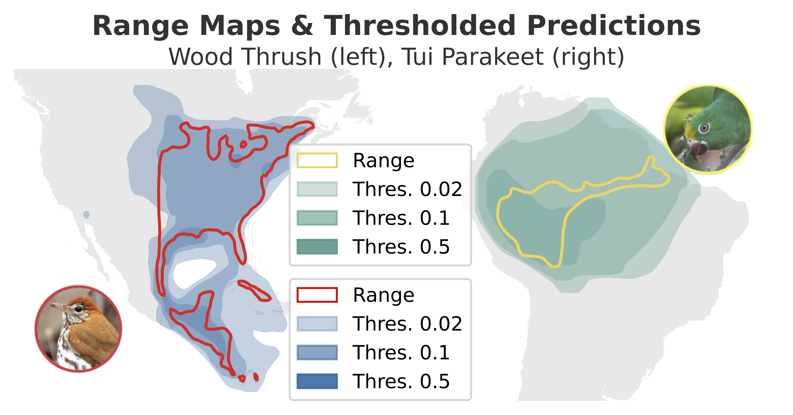

# Generating Binary Range Maps

Code for binarizing the output of global-scale species range estimation models. This code enables the recreation of the results from our [Computer Vision for Ecology Workshop](https://cv4e.netlify.app/) at ECCV 2024 paper [Generating Binary Species Range Maps](https://arxiv.org/abs/2408.15956). 


<table>
  <tr>
    <td valign="top" align="center" style="text-align: center;"></td>
   </tr> 
    <td align="left" valign="top">
      Binary range maps for two different species. These ranges are generated by the <a href="coleICML2023">SINR</a> SDM for <a href="https://www.inaturalist.org/photos/67458827">Wood Thrush</a> (left) and <a href="https://www.inaturalist.org/photos/157601882">Tui Parakeet</a> (right). Converting the continuous SDM outputs to binary range maps requires setting thresholds (e.g. 0.02, 0.1, or 0.5) which result in very different range maps depending on the values chosen. 
More importantly, here the same threshold value is not the best for both species. 
    </td>
</table>


## 🌍 Overview 
Accurate predictions of species’ ranges are crucial for assisting conservation efforts. Traditionally, range maps are manually created by experts. However, species distribution models (SDMs) and, more
recently, deep learning-based variants offer a potential automated alternative. Deep learning-based SDMs generate a continuous probability representing the presence of a species at a given location, which must be binarized by setting per-species thresholds to obtain binary range maps. However, selecting appropriate per-species thresholds to binarize
these predictions is non-trivial, since different species can require different thresholds. In this work, we evaluate different approaches for automatically identifying the best thresholds for binarizing range maps using presence-only data. This includes approaches that require the generation
of additional pseudo-absence data, along with ones that only require presence data. We also propose an extension of an existing presence-only technique that is more robust to outliers. We perform a detailed evaluation of different thresholding techniques on the tasks of binary range estimation and large-scale fine-grained visual classification, and we demonstrate
improved performance over existing approaches using our technique.

<table>
  <tr>
    <td valign="top" align="center" style="text-align: center;"></td>
   </tr> 
    <td align="left">Qualitative examples of estimated binary ranges. Each row depicts a different species, and the columns show the expert-derived range, output from the Target Sampling, and LPT-R approaches, respectively. Inset, we also display the different types of errors. We use an ocean mask for visualization purposes.</td>
</table>

## 🔍 Getting Started 

#### Cloning The Repository
This repository contains the submodule [SINR](https://github.com/elijahcole/sinr).

To clone the repo with the submodule run:
```bash
git clone --recurse-submodules https://github.com/filipgdorm/binary_range_maps.git
```

Alternatively, if the repo has already been cloned, the submodule can be installed by running the following commands within the repo:
```bash
git submodule init
git submodule update
```

#### Installing Required Packages

1. We recommend using an isolated Python environment to avoid dependency issues. Install the Anaconda Python 3.9 distribution for your operating system from [here](https://www.anaconda.com/download). 

2. Create a new environment and activate it:
```bash
 conda create -y --name binary_range_maps python==3.9
 conda activate binary_range_maps
```

3. After activating the environment, install the required packages:
```bash
 pip3 install -r requirements.txt
```
Note that this should be the `requirements.txt` in the root directory, NOT the one inside the submodule.


#### SINR Data Download and Preparation
Instructions for downloading the SINR data, which is needed for further experiments, are in `sinr/data/README.md`.

Additionally, to generate data files necessary for the thresholding methods, navigate to the `thresholding_dataset` directory and then run:
```bash
python generate_dataset.py
```
which will create the files `gdfk.csv` and `train_df_h3.csv`. The python script can be modified to use a different random initialization of the data, and to use a different resolution of the H3 library.

#### Downloading Models
To download the zipped folder containing the models in the paper:  
https://datasync.ed.ac.uk/index.php/s/AHbMtzLNn6rlKwz

The file is password protected, enter the password "`models`".
Unzip the file and make sure that it is in the root directory.


## 🗺️ Evaluating Methods

#### Generating Thresholds
The `threshold_generation.py` script is responsible for generating thresholds by leveraging the different methods explored in the paper.

```
usage: threshold_generation.py --method {lpt_x,rdm_sampling,tgt_sampling,rf_classifier,mlp_classifier,single_fixed_thres,mean_pred_thres}
                               [--species_set {iucn,snt,all,custom}] --model_path MODEL_PATH [--exp_name EXP_NAME]
```
The main requirements to run the script consist of:
* `--model_path`: which should be the path to one of the pre-trained models
* `--species_set`: choose what species to generate thresholds for. Can be the ones later used for evaluation or a custom species set.
* `--method`: choose the binarization method. Depending on the method chosen, additional parameters may be required. 
* `--exp_name`: name of the experiment, which will also be the name of the directory in the `results/` folder where the thresholds will be stored.

#### Evaluating Range Maps
After generating thresholds, they can be compared against expert range maps to compute the mean F1 score, i.e. to reproduce Table 1 and 2 from the paper. For this to work, the thresholds must have already been generated through `threshold_generation.py`, and the species must be a subset of either the IUCN or the S&T set. This script can also be used for additional baselines and upper bounds that do not use thresholds from csv files generated through `threshold_generation.py`

```
usage: evaluation.py --model_path MODEL_PATH [--exp_name EXP_NAME] [--evaluation_set {iucn,snt}]
                     [--eval_type {thresholds,upper_bound,single_best_thres,subsample_expert_data}] 
```
where `--exp_name` should be kept consistent with that of the threshold generation script to utilize those thresholds. 
 
 `--eval_type` is used to control whether we are evaluating `thresholds` created by the generation script, finding the `upper_bound` for each method, finding the best single fixed threshold (`single_best_thres`) or identifying the thresholds through subsampling a fraction of the expert data (`subsample_expert_data`). `--evaluation_set` specifies whether the IUCN set or S&T set is used for evaluation.


#### Geo Prior Evaluation
To reproduce the results in Table 3, the `geo_prior_evaluation.py` script can be used. This script uses predictions as geo priors for image classification, either the binarized output or continuous values.

```
usage: geo_prior_evaluation.py [--model_path MODEL_PATH] [--exp_name EXP_NAME] [--delta DELTA]
                               (--thres_from_csv | --single_threshold SINGLE_THRESHOLD | --continuous)
```
where the user should provide either:
 * `--thres_from_csv`: thresholds are used from the `exp_name` folder to binarize the predictions. For this to work, the `threshold_generation.py` script with `--species_set all` must be run first.
 * `--single_threshold SINGLE_THRESHOLD`: the user specifies one single threshold, e.g. 0.5, to binarize all predictions.
 * `--continuous`: the continuous raw predictions are used as geo priors (i.e. no binarization).

Additionally, the user can set `--delta` to an arbitrary value. In the paper a value of 0.01 was used.

##  🙏 Citation
```
@inproceedings{binary_maps_cv4e_2024,
  title     = {{Generating Binary Species Range Maps}},
  author    = {Dorm, Filip and Lange, Christian and Loarie, Scott and Mac Aodha, Oisin},
  booktitle = {Computer Vision for Ecology Workshop at ECCV},
  year = {2024}
}
```
## 📜 Disclaimer
Exercise caution when making decisions based on the model outputs presented here. Our goal is to showcase the potential of binarizing the output from deep learning species distribution models, not to produce definitive range maps.
